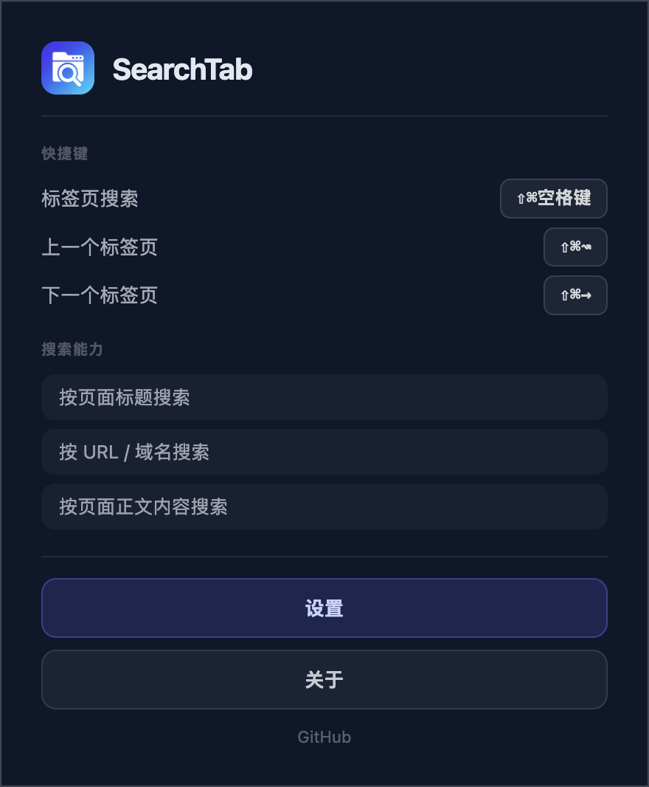

# SearchTab

像 macOS 聚焦搜索（Spotlight）一样，在浏览器已打开的标签页之间极速检索和切换。

**⚠️ 声明：本项目所有代码（包括实现、调试、重构、代码审查）均由 AI 大模型自动生成，未经人工 review。如有疑问请直接关闭页面，勿浪费彼此时间。**

---

## 功能

### 标签页搜索

按下快捷键在任意网页中央唤起搜索面板，输入关键词实时检索所有已打开的标签页。

- **标题、URL、域名、页面正文** 全字段搜索
- **中英文混合** 输入，支持子串匹配和轻量模糊搜索
- **匹配高亮**：标题和 URL 中命中关键词的部分以高亮色标注
- **关闭标签页**：悬停结果项时点击 × 直接关闭，无需切换过去再关
- **鼠标/触控板滚动** 浏览结果列表
- **输入法兼容**：IME 组合态中 Enter/Esc 不会误触发
- **自动过滤** 浏览器内部页面（newtab、设置、扩展管理等），仅索引互联网页面

> 截图：搜索面板唤起 + 输入关键词后的结果列表 + 匹配高亮效果


---

### 标签页快速切换

| 命令 | Windows / Linux | macOS |
|---|---|---|
| 上一个标签页 | `Ctrl + Shift + ←` | `⌘ + Shift + ←` |
| 下一个标签页 | `Ctrl + Shift + →` | `⌘ + Shift + →` |

只切换当前窗口中的互联网页面，到达边界时自动循环。

> 截图：切换到上/下一个标签页的效果展示


---

### 设置页面

点击工具栏图标 → **设置**，在独立标签页中打开配置界面。

- **快捷键管理**：查看和修改所有快捷键（搜索、标签页切换），每项配独立修改按钮
- **页面正文搜索开关**：关闭后仅搜索标题/URL/域名，降低资源占用，修改后立即生效

> 截图：设置页面全貌，展示快捷键列表 + 正文搜索开关



---

### 引导页

首次安装自动弹出，介绍使用方法和检索能力。工具栏图标 → **关于** 可随时重新打开。

---

## 使用方法

| 操作 | 快捷键 |
|---|---|
| 唤起搜索面板 | `Ctrl + Shift + Space` / `⌘ + Shift + Space` |
| 上下选择结果 | `↑` `↓` |
| 跳转到选中标签页 | `Enter` |
| 关闭选中标签页 | 鼠标悬停后点击 × |
| 关闭搜索面板 | `Esc` |
| 上一个标签页 | `Ctrl + Shift + ←` / `⌘ + Shift + ←` |
| 下一个标签页 | `Ctrl + Shift + →` / `⌘ + Shift + →` |

所有快捷键均可在 `chrome://extensions/shortcuts` 中自定义。

---

## 技术栈

| 层 | 技术 |
|---|---|
| 框架 | [WXT](https://wxt.dev) |
| 前端 | React + TypeScript |
| 搜索引擎 | [MiniSearch](https://github.com/lucaong/minisearch) |
| 存储 | IndexedDB / chrome.storage |
| 规范 | Chrome Extension Manifest V3 |

---

## 开发

```bash
npm install       # 安装依赖
npm run dev       # 开发模式（热更新）
npm run build     # 生产构建
npm run zip       # 打包 zip（用于分发）
```

## 安装

1. 打开 `chrome://extensions` 或 `edge://extensions`
2. 开启「开发者模式」
3. 点击「加载已解压的扩展程序」
4. 选择 `output/chrome-mv3` 目录

## 兼容性

Chrome / Edge / 所有 Chromium 内核浏览器（Manifest V3）

## 隐私

所有标签页数据仅在本地内存中建立索引，不会上传到任何服务器。关闭标签页后相关索引自动清除。

## License

[MIT](LICENSE)
